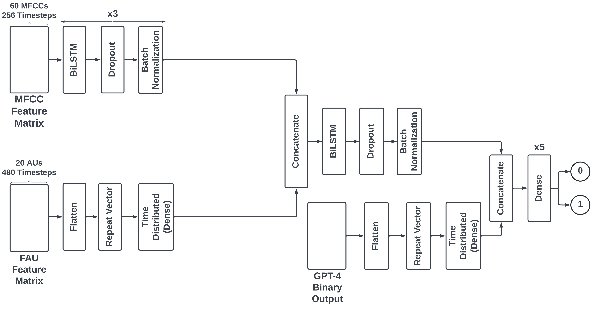
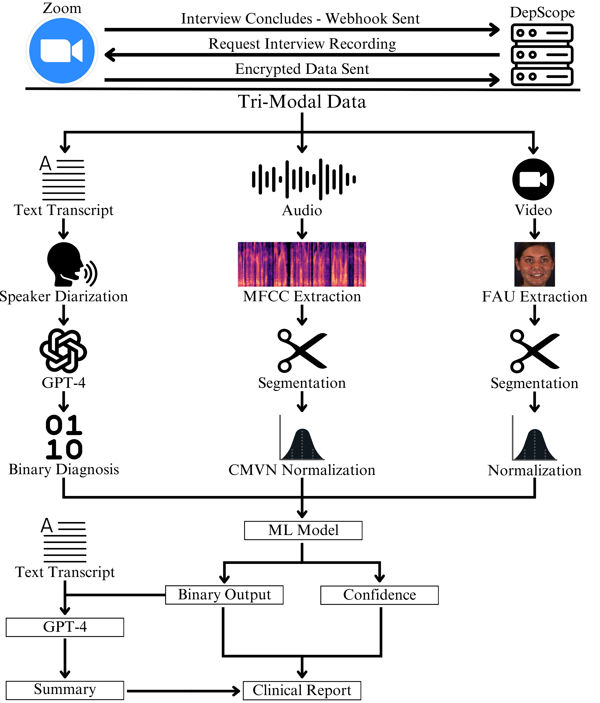
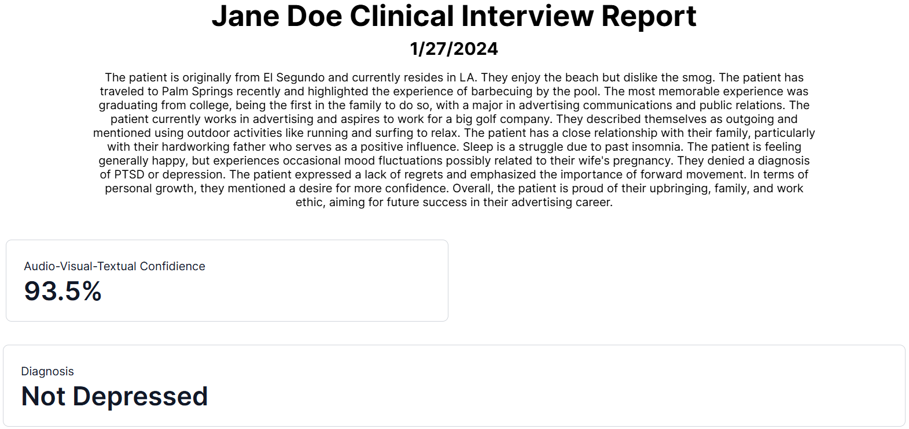

<div style="text-align: center;">
    
</div>
DepScope is an AI model which integrates three modalities—text, audio, and video—to classify a person as either depressed or not depressed given a clinical interview recording. This repository contains the code to deploy the model to a locally hosted Django application. More technical details can be found in the <a href="#implementation">implementation</a> section. 
<br></br>

You can find a live demo of the front-end [here](https://depscope.up.railway.app/). Please note that I have disabled Sign Up functionality on this live demo. Since DepScope relies on the Zoom API to create accounts, the app needs to be approved by the Zoom marketplace before it can be publicly used and connected to. I will update the live demo once my app is approved by the Zoom team, but for now, the only way to access the full functionality is through local hosting.

Check out the [demo video](https://youtu.be/oSeqm2-7foY).

## Quickstart

### Prerequisites

Ensure you have the following installed before moving onto installation.

#### Necessities

* Python (developed and tested with version 3.9)
    ```sh
    python --version
    ```

#### Recommendations

* Anaconda Package Manager
    ```sh
    conda update conda
    conda update anaconda
    ```
* Capable NVIDIA GPU (For Faster Inference)
    ```sh
    nvidia-smi
    ```

  ## Installation
1. Clone the repository
    ```sh
    git clone https://github.com/GITLINKHERE
    ```
   
2. Install necessary packages. It is recommended to install using a clean virtual environment to avoid dependency conflicts.
    ```sh
    pip install -r requirements.txt
    ```

3. Set up `.env` file. This repository uses environment variables to protect sensitive information. The following variables MUST be included in the .env file for the deployment to work:
    ```yaml
    # SMTP Credentials and Email Information
    EMAIL_HOST_USER: Email of Gmail account which you will use to send automated support / newsletter emails.
    EMAIL_HOST_PASSWORD: The password to the Gmail account specified above.
    STAFF_EMAIL: The email which will be included in all 'malito' links, places which specify contact information, and the email which recieves messages through the Contact form.
    
    # Zoom API Information
    CLIENT_ID: The client ID for your Zoom Application. This will be used in Zoom API requests.
    CLIENT_SECRET: The secret key used to verify the identity of your Zoom application.
    ZOOM_PRO: Whether or not the person hosting the application locally has a Zoom Pro account. This variable is only necessary during testing. If set to `false`, no errors will be thrown regarding recordings not existing, as cloud recordings are a feature only available for Zoom Pro users.
    
    # PostgreSQL Database information
    DB_NAME: The name of the database which will be used to store user information.
    DB_USER: The username of the database.
    DB_PASSWORD: The password of the database.
    DB_HOST: The host of the database.
    DB_PORT: The port of the database.
    
    # OPENAI
    GPT_MODEL: The ID of the OpenAI fine-tuned model which you would like to use for text information processing.
    
    # Django Secret Key
    DJANGO_SECRET: The secret key used by Django to secure the application. This should be a long, random string.
    ```
4. Set up database
    ```sh
    python manage.py makemigrations
    python manage.py migrate
    ```
5. Run the application
    ```sh
    python manage.py runserver
    ```

### Generating Sample Data
For those who do not have a Zoom Pro account or have any Zoom recordings to use, you can generate sample data for your dashboard to test the application through the `/generate_samples_endpoint` url. This url adds four pre-made clincal reports, based on real clinical interview recordings, to the specified user dashboard.
```sh
curl -X POST http://localhost:8000/generate_samples_endpoint/user_id
```

## Implementation
This section covers how DepScope and its deployment function.

### DepScope Model

##### *Figure: DepScope architecture following hyperband tuning.*


The final model architecture, which has been optimized by the Hyperband Tuning Algorithm, incorporates two biomarkers:
1) Facial Action Units (FAUs): Facial Action Units (FAUs), a low-level representation of the movements of specific facial muscles, were introduced as part of the Facial Action Coding System . FAUs allow us to objectively study facial expressions and decipher non-verbal cues. This makes them highly effective and popular for affective computing tasks.
2) Derived using the Mel Scale, Mel Frequency Cepstral Coefficients (MFCCs) provide a compact representation of the human perception of sound. This allows for the low-level analysis of timbre, pitch, and rhythm.

The architecture follows 7 steps to reach a classification:
1) The model extracts higher level features from the MFCCs in three consecutive blocks consisting of BiL- STM, Dropout, and Batch Normalization layers.
2) The input FAU data follows three processing steps to make it suitable for concatenation with the MFCC tensor: (a) The FAU data is first flattened into a 1D tensor. (b) The Keras Repeat Vector layer repeats the flattened data for each timestep present in the processed MFCC tensor, resulting in a 3D tensor. (c) Lastly, the Time Distributed operation applies a Dense layer to each temporal slice, where the number of neurons is the number of feature dimensions in the MFCC tensor. These operations result in a higher-level representation of the FAUs with the same dimensions as the processed MFCC data, allowing concatenation in the following step.
3) The processed FAU and MFCC data are concatenated along the features axis.
4) The concatenated data is processed by consecutive BiL- STM, Dropout, and Batch Normalization layers.
5) The same sequence of operations applied in step two is applied to the LLM binary output to prepare it for concatenation with the MFCC-FAU tensor.
6) The MFCC-FAU and LLM tensors are concatenated.
7) The combined tensor is processed by four consecutive Leaky ReLU-activated Dense layers and one sigmoid- activated layer. A binary classification is output.

It was trained on the DAIC-WoZ dataset, a collection of 189 deidentified clinical interviews.

##### *Figure: Comparison of DepScope model to baseline models on AVEC 2016 Challenge Benchmark DAIC-WoZ split*


### Deployment
DepScope was integrated into a locally hosted web application for easy and accessible use of the model by clinicians.

##### *Figure: DepScope web application clinical interview processing architecture. Note that webhooks are not included in the local deployment, as such functionality is only possible in publicly accessible servers.*


##### *Figure: Clinician dashboard*


##### *Figure: Sample clinical report*


Clinicians first connect their Zoom account to the web application and agree to the necessary terms, consenting that their clinical interview recordings may be processed by the DepScope application. This is done through the Zoom Application Programming Interface (API). From there, any time a clinical interview concludes over Zoom, a webhook is sent to the DepScope backend. The recording is then retrieved from the Zoom servers for preprocessing, model inference, and clinical report generation via GPT-4. Clinical reports contain a summary of the interview, detailing all key points and a justification for why the diagnosis was drawn. Reports additionally contain the confidence of the model in the classification, which is output by the sigmoid activation function. This processing is done asychronously through Celery and Redis. Reports populate the clinician dashboard.

### SWE Stack
<div style="display: flex; align-items: center; height: 100px;">
  
  
  
  
  
  
  
  
  
  
</div>

I additionally used several smaller JavaScript libraries and Python packages. Associated copyright information can be found in the corresponding files. Examples include OpenFace, animate.css, and select2.

###### 2024 Congressional App Challenge Submission
